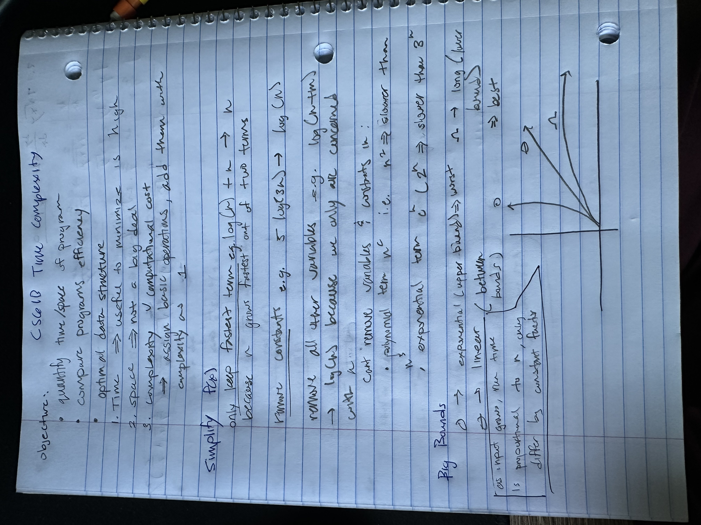
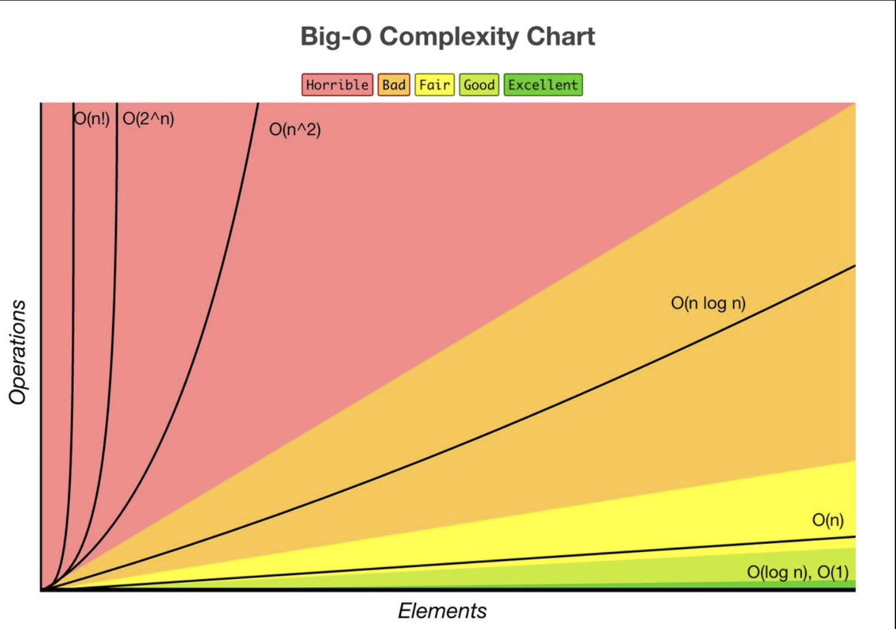

#### CS61B Sp25
# Asymptotic Analysis
#### Sean Villegas

- **Tetration:** raising a number to itself multiple times. 
    - $^43 = $ is a power tower 43. Raise 3 to the power of itself four times $\implies 3^{(3^{(3^3)})}$ 
    1. $3\uparrow \uparrow 1 = 3$
    2. $3\uparrow \uparrow 2 = 27$
    3. $3\uparrow \uparrow 4 = 3^{(3^{27})}$

## Amortization 