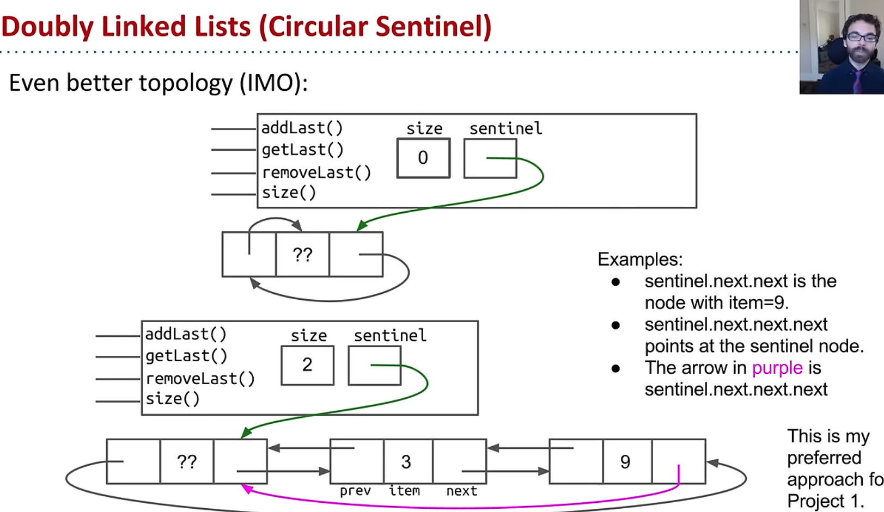

# Double Linked List
## Sean V notes

[Sources](https://www.youtube.com/watch?v=BspFdzVvYe8&list=PL8FaHk7qbOD5Gy1o06RRilCqv0So31lJt&index=4)

### Approach for Project
1. Right now, SLList method addLast is slow because we recurse through it completely 
2. The solution to that is to have a pointer at the start of the line, that points to the end of the line, and the end pointer points to the beginning of the list. Creating a circle
    - as you add elements to the list, the double linked list pointer is preserved in memory and elements are added to the middle
    - this approach is the double linked lists (double sentinel)
    - the monk approach: is to have a sentinel as both first and last of the list
    
### **READ THIS**
-  whenever you have an empty list, the previous is sentinel itself, and the next is the sentinel itself

**A note on adding a pointer to last element in the list**
1. addLast, getLast, size will be fast thanks to caching 
2. However, removeLast is slow because: *you need to fix the pointers to second last item*
    - approaching with caching, is not the correct approach because we can hit the problem of getting nth to last item
3. **Solution:** is to have a previous memory box pointer that points to the predecessor, and the next pointing to the next predecessor

### Generic Lists
TL;DR: when you specify the type at the beginning of the file, public class SSList<BleepBlorb>, and you declare and instantiate later java will compile and substitute the types when interacting with it

### Interfaces
[BroCode](https://www.youtube.com/watch?v=GhslBwrRsnw)

1. Dont repeat yourself
2. Less bugs in future
3. an interface is a keyword that specifies what a child type of a parent hyperm is able to do, not how to do it
4. you must implement a interface for 'is a' relationship

### Overriding and Overloading  

overriding must be inherited, and have same method signature as superclass
overloading is anytime there is two methods with same names but different signatures

1. cs61b always marks overriding method with @Override
    - if code isnt used it wont compile
    - good for typo checking
    - nothing but a signal
    - If a method is annotated with @Override but does not actually override a method from a superclass or implement a method from an interface (e.g., due to a typo in the method name, an incorrect signature, or the absence of the method in the parent hierarchy), the compiler will generate a compile-time error. 
2. Dynamic method selection is a Prof Hug term
    - [CS61B Official Guide](https://cs61b.bencuan.me/oop/dynamic-method-selection)