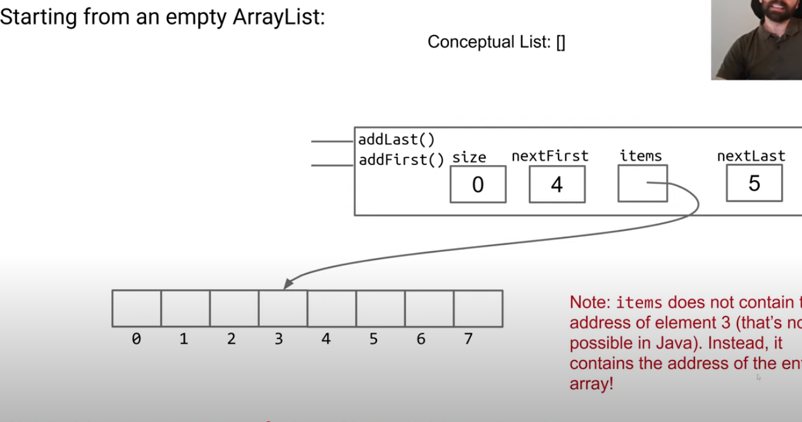
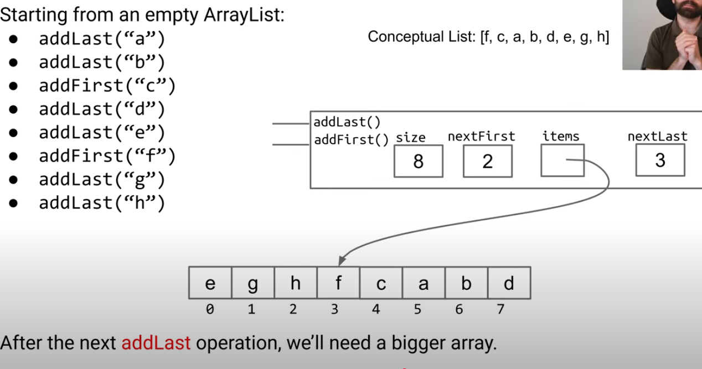

# Week 4 - Interface and Implementation Inheritance
## [Iterators Object Methods](https://www.youtube.com/watch?v=YpCZjgoBYJA&list=PLnp31xXvnfRrvh9PM0gK9fm7VAD0HdijJ&index=1)
## [Interface and Implementation Inheritance](https://www.youtube.com/watch?v=Ms-CgZWT1Qo)
## [Subtype Polymorphism, Function Passing, Generic Functions](https://www.youtube.com/watch?v=0qw-12Bp4Ew)
## [ArrayLists](youtube.com/watch?v=bCzm0P5Ukfo&list=PL8FaHk7qbOD4OkPxiepJoKY28imSjpF_4&index=9)


## README
- I strongly reccommend understanding this structure
- Understand Loitering and why you shouldnt do it when storing generic types
- There is some math operations you can perform to add items to a list.
  - addFront = (front - 1 + items.length) & items.length
  - addBack = (front + size) % items.length




```java
public class Person {
    private String name;

    public Person(String name) {
        this.name = name; // "this" is required, otherwise you'd just assign the parameter to itself
    }
}


public Person() {
    this("Unknown"); // calls the other constructor
}


public Person() {
    this("Unknown"); 
}


```


- **Potential Watch Out:** common misconception (for confusing instanceof with .getClass())
  - the above is a note from AI. I am not sure this is in scope

### Implementing Comparable

```java
List<Dog> dogs = new ArrayList<>();
dogs.add(new Dog("Grigometh", 200));
dogs.add(new Dog("Pelusa", 5));
dogs.add(new Dog("Clifford", 9000));
Dog maxDog = Collections.max(dogs);


// ensure you have below
public interface Comparable<T> {
    int compareTo(T o);
}


public class Dog implements Comparable<Dog> {
   ...
   @Override
   public int compareTo(Dog uddaDog) {
       if (size > uddaDog.size) {
           return 1;
       }
       if (size < uddaDog.size) {
           return -1;
       }
       return 0;
   }
}

// less lines of code

public class Dog implements Comparable<Dog> {
   ...
   @Override
   public int compareTo(Dog uddaDog) {
       return this.size - uddaDog.size;
   }
}

```


### ArraySet
```java
import java.util.Iterator;
public class ArraySet<T> implements Iterable<T> {
    private T[] items;
    private int size; // the next item to be added will be at position size

    public ArraySet() {
        items = (T[]) new Object[100];
        size = 0;
    }

    /* Returns true if this map contains a mapping for the specified key.
     */
    public boolean contains(T x) {
        for (int i = 0; i < size; i += 1) {
            if (items[i].equals(x)) {
                return true;
            }
        }
        return false;
    }

    /* Associates the specified value with the specified key in this map.
       Throws an IllegalArgumentException if the key is null. */
    public void add(T x) {
        if (x == null) {
            throw new IllegalArgumentException("can't add null");
        }
        if (contains(x)) {
            return;
        }
        items[size] = x;
        size += 1;
    }

    /* Returns the number of key-value mappings in this map. */
    public int size() {
        return size;
    }

    /** returns an iterator (a.k.a. seer) into ME */
    public Iterator<T> iterator() {
        return new ArraySetIterator();
    }

    private class ArraySetIterator implements Iterator<T> {
        private int wizPos;

        public ArraySetIterator() {
            wizPos = 0;
        }

        public boolean hasNext() {
            return wizPos < size;
        }

        public T next() {
            T returnItem = items[wizPos];
            wizPos += 1;
            return returnItem;
        }
    }

    @Override
    // most efficient way o(n)
    public String toString() {
        StringBuilder returnSB = new StringBuilder("{");
        for (int i = 0; i < size - 1; i++) {
            returnSB.append(items[i].toString());
            returnSB.append(", ");
        }
        returnSB.append(items[size - 1]);
        returnSB.append("}");
        // use toString to have the correct type (to get the string outside of the string builder)
        return returnSB.toString();
    }


    @Override
    public String toString() {
        StringBuilder returnSB = new StringBuilder("{");
        for (int i = 0; i < size - 1; i += 1) {
            returnSB.append(items[i].toString());
            returnSB.append(", ");
        }
        returnSB.append(items[size - 1]);
        returnSB.append("}");
        return returnSB;
    }

    @Override
    public String toStringOld() { 
        String returnString = "{";
        for (T item : this) {
            returnString += item; 
            returnString += ", ";
        }
        returnString += "}";
                // can be return returnString
        return returnString;
    }

    // quadratic time
    @Override
        public String toStringOld() { 
        String returnString = "{";
        for (int i = 0; i < size - 1; i += 1) {
            returnString += items[i].toStringOld();
            returnString += ", ";
        }
        returnString += "}";
        return returnString;
    }

    /* EXTRA VIDEO CODE
    @Override
    public String toString() {
        List<String> listOfItems = new ArrayList<>();
        for (T x : this) {
            listOfItems.add(x.toString());
        }
        return "{" + String.join(", ", listOfItems) + "}";
    } */

    /* EXTRA VIDEO CODE
    public static <Glerp> ArraySet<Glerp> of(Glerp... stuff) {
        ArraySet<Glerp> returnSet = new ArraySet<Glerp>();
        for (Glerp x : stuff) {
            returnSet.add(x);
        }
        return returnSet;
    } */


    @Override
    public boolean equals(Object other) {
        if (this == other) {
            return true;
        }
        if (other == null) {
            return false;
        }
        if (other.getClass() != this.getClass()) {
            return false;
        }
        ArraySet<T> o = (ArraySet<T>) other;
        if (o.size() != this.size()) {
            return false;
        }
        for (T item : this) {
            if (!o.contains(item)) {
                return false;
            }
        }
        return true;
    }

    // slides code
    public boolean equals(Object other) {
        if (this == other) { return true; }
        if (other instanceof ArraySet otherset) {
            if (this.size != other.size) { return false; }
            for (T x : this) {
                if (!otherSet.contains(x)) {
                    return false; 
                }
            }
            return true;
        }
        return false; 
    }

    public static void main(String[] args) {
        ArraySet<Integer> aset = new ArraySet<>();
        aset.add(5);
        aset.add(23);
        aset.add(42);

        //iteration
        for (int i : aset) {
            System.out.println(i);
        }

        //toString
        System.out.println(aset);

        //equals
        ArraySet<Integer> aset2 = new ArraySet<>();
        aset2.add(5);
        aset2.add(23);
        aset2.add(42);

        System.out.println(aset.equals(aset2));
        System.out.println(aset.equals(null));
        System.out.println(aset.equals("fish"));
        System.out.println(aset.equals(aset));

        //EXTRA VIDEO CODE
        //ArraySet<String> asetOfStrings = ArraySet.of("hi", "I'm", "here");
        //System.out.println(asetOfStrings);
    }

    /* Also to do:
    1. Make ArraySet implement the Iterable<T> interface.
    2. Implement a toString method.
    3. Implement an equals() method.
    */
}
```

### AList Lecture Progression
```java
public void addLast(int x) {
    if (size == items.length) {
        int[] a = new int[size + 1];
        System.arraycopy(items, 0, a, 0, size);
        items = a;
    }
    items[size] = x;
    size++;
}
```

- Computers will do a billion things per second. 
- N(N+1)/2 for time complexity calculations
- preallocate capacity * 2 to make resizing efficient
- Use casting on generic AList to get passed cant instantiate compiler error


## Project 2

- advised not to use arraycopy for the project, use for loop
  - this makes looping through your data structure easier. As you will have pointers to nextFirst and nextLast that can wrap around linearly, therefore making the order appear not ordered because there is white space in the array list. The user of this data structure will not know, and will see [a, b, c, d]; but we will see: [d, null, null, a, b, c] for example. This is just an example and the representation can be vastly different ordering.
- dont do resizing until you have working code
- use get to get back to first element with 0
- use ArrayDeque for circular approach

## Prof Ramblings
1. Python Lists implement this structure
  - however inserting is not a common operation and therefore its computationally heavy because programmers dont want to deal with that complexity
2. `extends` wont be covered in midterm 1. Worry about that later